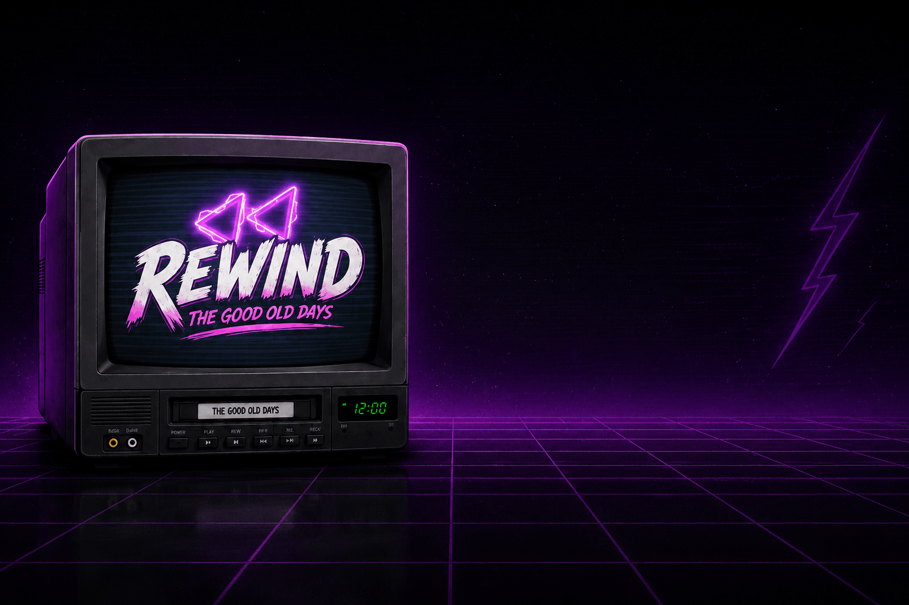

# 📺 Rewind Static ($RWD) — The Good Old Days

<div align="center">



### *90s Saturday Morning Cartoons Reborn on Solana*

[](https://nextjs.org/)
[](https://react.dev/)
[](https://tailwindcss.com/)
[](https://solana.com/)
[](https://www.typescriptlang.org/)

</div>

---

## ⚡ Contract Address (CA)

```text
aZXVx5Q5hwQQkSp5sJ8hWoNzjX4nFHQHmBX6oCjpump
```

> **Network**: Solana (`SOL`)  
> **DEX / Swap**: [Raydium](https://raydium.io/) / [Jupiter](https://jup.ag/)  
> **Official X**: [@RewindStatic78](https://x.com/RewindStatic78)  
> **Official Telegram**: [t.me/RewindStatic](https://t.me/RewindStatic)

---

## 🕹️ About Rewind Static

**Rewind Static ($RWD)** is a community-driven cryptocurrency on Solana dedicated to the timeless feeling of 90s Saturday morning cartoons, VHS static, and pure childhood nostalgia. No VC bags, no early presales, and no complex lore — just a chart everyone gets to watch from the same couch.

---

## ✨ Features & Architecture

### 1. 📺 Hero Experience
- Custom dual-screen adaptive background rendering (`hero-bg.png` for landscape desktop, `hero-bg-mobile.png` for portrait mobile).
- CRT scanline grid, dynamic neon glow effects, and responsive layout.

### 2. 🎞️ Continuous Neon Marquee
- Ultra-smooth continuous CSS marquee ticker track (`WATCH CARTOONS ✦ CHART GO UP ✦ SEND IT`).

### 3. 📼 Nostalgia Storyline ("Remember When Life Was Simple?")
- 90s storytelling typography pairing **Morton** (black-weighted uppercase headings) and **Frygia** (body copy).
- Authentic retro icon asset displays with atmospheric drop-shadows.

### 4. 🛸 The Plan (Interactive Timeline)
- 3-step vertical interactive roadmap connected via an illuminated gradient neon pipeline.
- Right: Large retro animated TV GIF (`/tv-aniamted.gif`) with ambient neon aura.

### 5. 🕹️ Play Rewind Climber
- In-browser retro pixel platformer showcase linked directly to [Rewind Climber](https://rwdretrorun.netlify.app/).
- Arcade status panel, token pool swap rate overview (3 in-game coins = 1 $RWD), and live leaderboard integration details.

### 6. 🟣 How to Buy $RWD
- 4-step pipeline featuring high-contrast solid black circular nodes encased in pulsating neon purple/magenta glowing rings (`sol.png`, `wallet.png`, `swap.png`, `rewind-logo.png`).
- Integrated Contract Address (CA) copy box with real-time feedback.

### 7. 🛡️ The Fair Launch Pledge & FAQ
- **Left**: 3 core pledge tenets (No Presale, LP Locked, Community-Driven) with custom icon badges.
- **Right**: Smooth interactive FAQ accordion powered by Framer Motion `AnimatePresence` and rotating toggle indicators.

### 8. 👾 Social Hub & Retro Footer
- X (Twitter) & Telegram custom glass cards with circular neon icon nodes.
- Prominent **Kid Social** character artwork with dynamic hover glow.
- Modern footer with high-res logo typography and animated TV visual.

---

## 🛠️ Tech Stack

- **Framework**: [Next.js 15 (App Router)](https://nextjs.org/)
- **Core Library**: [React 19](https://react.dev/)
- **Styling**: [Tailwind CSS v4](https://tailwindcss.com/) with `@theme inline` custom tokens
- **Animations**: [Framer Motion](https://www.framer.com/motion/) & [GSAP](https://greensock.com/gsap/)
- **Icons**: [Lucide React](https://lucide.dev/)
- **Typography**: Local Fonts configured via `next/font/local`:
  - **Morton**: Primary Display & Section Headings (Weights 100–900)
  - **Frygia**: Body Copy, Labels, and UI Components (Weights 100–900)
  - **Cartoonist JNL**: Retro Accent Brand Lettering

---

## 🚀 Getting Started

### Prerequisites
- Node.js 18.18+ or 20+
- npm, pnpm, or yarn

### Installation

```bash
# Clone the repository
git clone https://github.com/rewind-static/rewind-static.git

# Navigate into project directory
cd "rewind static"

# Install dependencies
npm install
```

### Run Development Server

```bash
npm run dev
```

Open [http://localhost:3000](http://localhost:3000) in your browser to view the application.

### Production Build

```bash
npm run build
npm run start
```

---

## 📁 Project Structure

```text
rewind static/
├── app/
│   ├── globals.css          # Tailwind CSS v4 styling, custom fonts & neon utilities
│   ├── layout.tsx           # Local fonts setup, SEO metadata & OpenGraph tags
│   └── page.tsx             # Complete single-page landing experience (Sections 1-7 + Nav & Footer)
├── components/
│   ├── providers/           # Smooth scroll & context providers
│   └── ui-patterns/         # Magnetic buttons & interaction components
├── lib/
│   └── gsap.ts              # GSAP & spring animation configurations
└── public/
    ├── fonts/               # Morton & Frygia OTF/WOFF2 font collections
    ├── htb/                 # "How to Buy" step icons (sol.png, wallet.png, swap.png, rewind-logo.png)
    ├── social/              # Social brand icons (x.png, tele.png)
    ├── hero-bg.png          # Desktop hero banner & OpenGraph share banner
    ├── hero-bg-mobile.png   # Portrait mobile hero background
    ├── tv-aniamted.gif      # Retro animated CRT television GIF
    ├── social-kid.png       # Community character artwork
    └── rewind-logo.png      # Official favicon & logo token asset
```

---

## 📜 Disclaimer

$RWD is a meme coin created for entertainment and community nostalgia purposes only, with no intrinsic financial value or guarantee of profit. Always do your own research (DYOR) and never risk funds you cannot afford to lose.

---

<div align="center">
  <p>© 2026 Rewind Static. Built for the cartoons, the couch, and the culture.</p>
</div>
